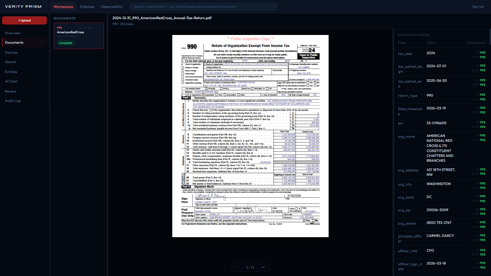

# Verity Prism

[](https://github.com/corvus-0x/verity-prism/actions/workflows/ci.yml)

An intelligent document processing platform that turns any document into structured, queryable data — and gives operators the tools to verify every extraction against the source.

Fraud investigation is the proving ground. The same engine runs insurance, legal, and compliance verticals without modification. This one should be operable by a new user in 20 minutes.

---



---

## Why It Exists

Intelligent document processing is enterprise software priced like enterprise software. Hyland OnBase — the incumbent in records and case management — runs six-figure annual licenses, and the people who operate it pay $3,000 per certification to learn how. The cloud APIs meter the same work by the page: AWS Textract charges $50 per 1,000 pages to pull the fields off a form, $15 per 1,000 more for the tables on it, and Azure stacks extraction, add-ons, and query fields the same way.

None of that was a path I had. No enterprise budget, no vendor relationship, no certification. So the constraint set the shape: it had to run on a laptop in Docker, cost nothing but an API key to stand up, and be learnable without a course. A new user should be productive in 20 minutes — not after a $5,000 certification track.

The limit turned out to be the design. A document platform whose every extraction you can verify against the source — that you can read end to end and run yourself — is worth more to the people doing the work than one they need a certificate to touch.

---

## What It Does

**Ingest any document** — PDF, scanned image, or XML — and extract every data point into individual database fields. A deed with 64 fields produces 64 rows. Every field is individually queryable, confidence-scored, and evidence-linked.

**Review what the AI missed** — A schema-driven pane shows every field the schema defines alongside the PDF. Low-confidence fields are pre-filled and flagged. Fields the AI never extracted are empty and editable. Click any field and a highlight box appears on the PDF at that value's location. Corrections store a captured PDF region as evidence.

**Search and investigate** — Plain-English queries hit a full-text + field-level search index. An agentic AI chat (native Anthropic tool-use) answers questions grounded in actual extracted data from the workspace — not hallucinated from training data.

**Track everything** — Immutable audit log enforced at the PostgreSQL trigger level. Every upload, search, correction, and file access is a permanent, tamper-proof record.

---

## Quick Start

```bash
cp backend/.env.example backend/.env   # add your Anthropic API key
docker-compose up --build
```

| Service | URL |
|---|---|
| Frontend | http://localhost:5173 |
| Backend API | http://localhost:8000 |
| API docs | http://localhost:8000/docs |

```bash
# Required on first run — seeds all 11 document type schemas
docker-compose exec backend python -m app.seeds.document_schemas

# Required after any pull
cd backend && alembic upgrade head
```

---

## Stack

| Layer | Technology |
|---|---|
| Frontend | React 18 + Vite + Tailwind CSS + Recharts |
| Backend | Python 3.12 + FastAPI |
| Database | PostgreSQL 16 |
| ORM + Migrations | SQLAlchemy 2.0 + Alembic |
| AI | Anthropic Claude API (claude-sonnet-4-6) |
| OCR | PyMuPDF + pytesseract (300 DPI) |
| Auth | JWT via httpOnly cookie + Bearer |
| PDF rendering | react-pdf (pdf.js, text layer) |
| Containers | Docker + docker-compose |

**240 tests**: 222 backend, 18 frontend. All passing.

---

## How This Is Built

AI-first, on purpose. Claude Code writes most of the implementation. The harness it works inside is versioned in this repo:

- **`.claude/skills/`** carries the project codegen: `gen-migration` produces Alembic migrations inside Docker, `new-story` scaffolds Storybook stories against the design checklist, `verity-prism-pr-description` builds PR descriptions from the phase spec instead of from memory.
- **`.claude/agents/storybook-reviewer.md`** is a custom review agent. Every story file gets graded against the component checklist before it merges.
- **`CLAUDE.md`** holds the same conventions a new engineer would get in onboarding: TDD with the failing test first, thin routers, soft deletes everywhere, docstring standards. The AI is held to all of them.
- **Every PR** gets a CodeRabbit review and a full CI run. Nothing merges red.

The division of labor is deliberate. Architecture, the data model, and what counts as done stay human decisions.

---

## Architecture

```
Documents → Ingestion Pipeline → Extraction Engine → Knowledge Base → Verticals → UI
              (hash, OCR,          (type detect,        (PostgreSQL,    (fraud,
               store)               field extract)       FTS, audit)     insurance, ...)
```

**Engine vs. cap.** The extraction engine ships to every customer — it knows nothing about fraud or insurance. A vertical cap installs on top: schema definitions, signal rules, workflow config, export formats. The fraud cap never ships to an insurance customer. Adding a new vertical is configuration, not code.

**Row-per-field extraction.** `document_extractions` stores one row per field per document. A 64-field deed = 64 rows. Every data point is individually queryable, confidence-scored, and filterable — no JSON parsing required.

**Schema-driven pipeline.** `document_schemas` drives type detection, routing, and extraction. `parse_strategy` selects Claude extraction or XML direct parse. Adding a new document type is one database row.

---

## Capabilities

<details>
<summary>Extraction engine</summary>

- Dual confidence per field: AI confidence (model certainty) + OCR confidence (text clarity in source)
- Per-field thresholds: high-stakes fields can require tighter confidence than low-stakes fields
- Field validation: `required`, `min_length`, `max_length`, `regex` per field in schema definition
- Partial batch retry: transient API failures retried silently before routing to human review
- Schema field groups: fields organized into document-logical sections for the review form

</details>

<details>
<summary>Document review pane</summary>

- Schema-driven: shows every defined field whether extracted or not
- PDF text layer highlighting: active field highlights its location on the source document
- Multi-match navigation when a value appears in multiple places (grantor name in deed body + signature + notary)
- Four field states: auto-extracted, low confidence, not extracted, source obscured (physical damage)
- Evidence capture: corrections store page number, bounding box, and cropped PDF image
- Document flagging: structured rejection reasons travel through the audit trail

</details>

<details>
<summary>Observability dashboard</summary>

- Automation rate: % of documents processed without human intervention
- 30-day volume trend: inbound vs completed
- Extraction quality by schema: avg AI confidence, avg OCR confidence, retry rate, correction rate
- Current processing: pending + review queue counts

</details>

<details>
<summary>Platform</summary>

- Immutable audit log (PostgreSQL trigger — UPDATE/DELETE raise an exception at the DB level)
- Soft deletes everywhere — nothing permanently removed from an evidence platform
- Real-time extraction status via SSE — badge flips without a page refresh
- Data export: per-document and workspace CSV/JSON with formula injection protection
- Schema library at `/schemas` — browse all active document types and field definitions

</details>

---

## Build Journal

1 posts on the reasoning behind specific decisions — not feature announcements, but the thinking that shaped the architecture.

[From Case to Code](https://corvus-0x.hashnode.dev) on Hashnode.

---

## Documentation

- [`docs/roadmap.md`](docs/roadmap.md) — phase status and what's next
- [`docs/build-tracker.md`](docs/build-tracker.md) — session log with the why behind each build decision
- [`docs/superpowers/specs/`](docs/superpowers/specs/) — design specs written before each build

---

## Pricing sources

The cost figures in *Why It Exists*, with their basis — strongest evidence first:

- **AWS Textract** — [official pricing](https://aws.amazon.com/textract/pricing/), confirmed June 2026: $50 per 1,000 pages (Forms), $15 per 1,000 (Tables).
- **Hyland OnBase certifications** — [Hyland University](https://university.hyland.com/pages/certifications), [University of Colorado OnBase training](https://www.cu.edu/uis/onbase-online-training-and-certifications): $3,000 per certification.
- **Hyland OnBase licenses** — Hyland does not publish pricing. The six-figure enterprise figure is user-reported via [ITQlick](https://www.itqlick.com/onbase/pricing) and [TrustRadius](https://www.trustradius.com/products/onbase-by-hyland/pricing); smaller deployments run lower.
- **Azure AI Document Intelligence** — [official pricing](https://azure.microsoft.com/en-us/pricing/details/document-intelligence/): per-page metered extraction plus add-ons and query fields.

---

*Built by [Corvus](https://corvus-0x.hashnode.dev)*
